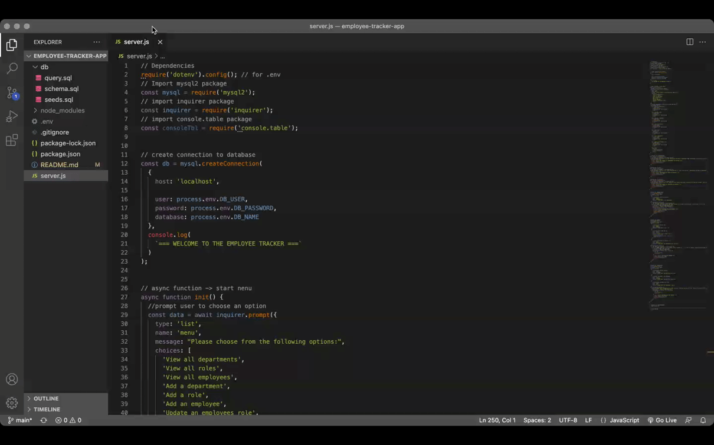
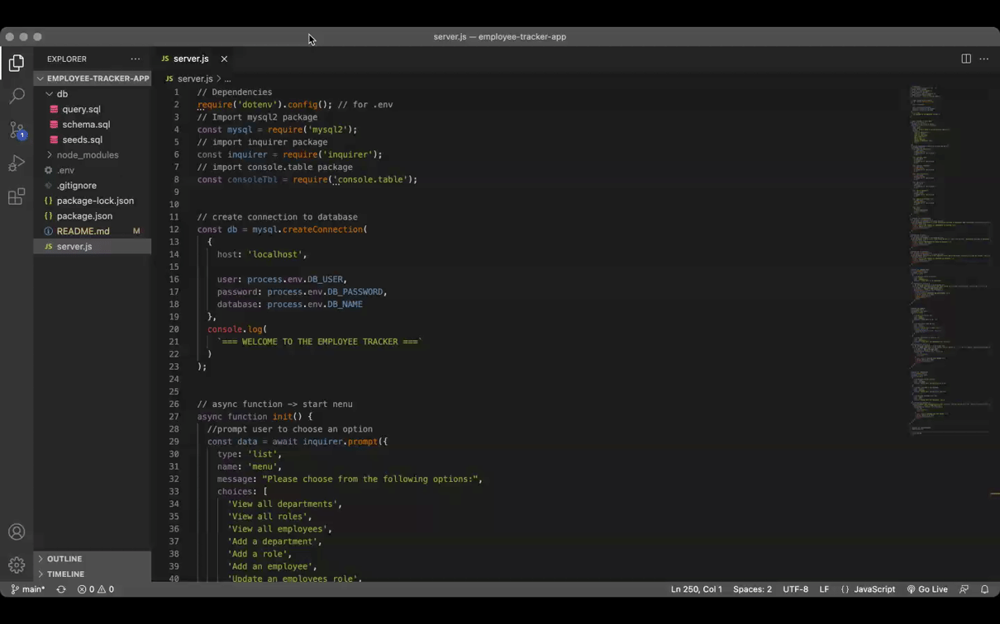
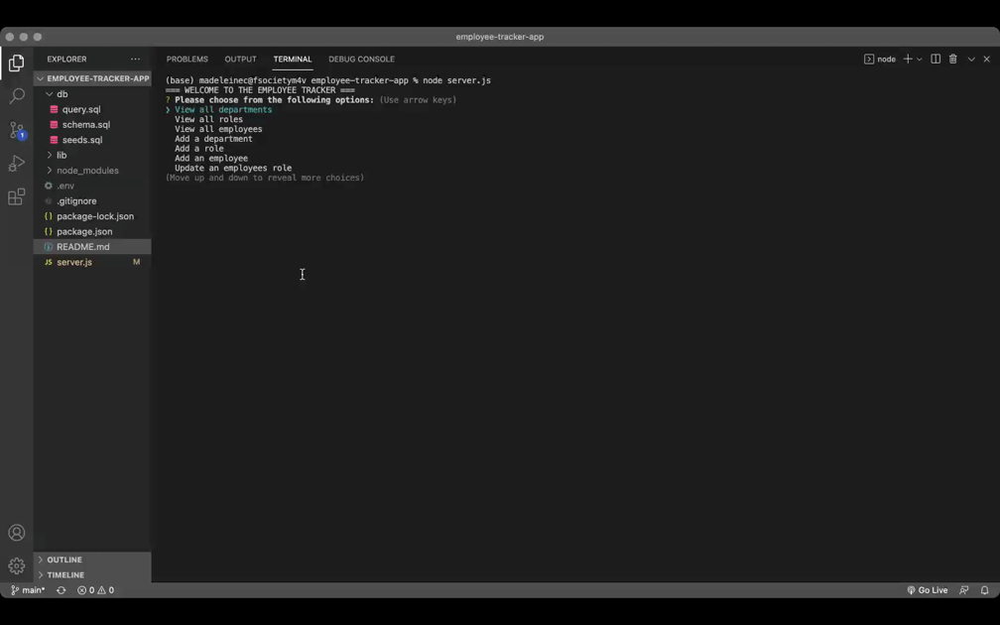

# EMPLOYEE TRACKER APP


# Table of Contents:
- [License](#license)
- [Description](#description)
- [User Story](#userstory)
- [Criteria](#criteria)
- [Usage](#usage)
- [Packages](#packages)
- [Issues](#issues)
- [Questions](#questions)
- [Credits](#credits)

  
# License

[MIT](https://opensource.org/licenses/MIT)


# Description
The Employee Tracker is a command-line application that makes it easier to manage a company's employee database using node.js, Inquirer, console.table and MySQL.


# User Story
```md
AS A business owner
I WANT to be able to view and manage the departments, roles, and employees in my company
SO THAT I can organize and plan my business
```

# Criteria
```md
GIVEN a command-line application that accepts user input
WHEN I start the application
THEN I am presented with the following options: view all departments, view all roles, view all employees, add a department, add a role, add an employee, and update an employee role
WHEN I choose to view all departments
THEN I am presented with a formatted table showing department names and department ids
WHEN I choose to view all roles
THEN I am presented with the job title, role id, the department that role belongs to, and the salary for that role
WHEN I choose to view all employees
THEN I am presented with a formatted table showing employee data, including employee ids, first names, last names, job titles, departments, salaries, and managers that the employees report to
WHEN I choose to add a department
THEN I am prompted to enter the name of the department and that department is added to the database
WHEN I choose to add a role
THEN I am prompted to enter the name, salary, and department for the role and that role is added to the database
WHEN I choose to add an employee
THEN I am prompted to enter the employee’s first name, last name, role, and manager, and that employee is added to the database
WHEN I choose to update an employee role
THEN I am prompted to select an employee to update and their new role and this information is updated in the database 
```

# Usage
To access the Employee Tracker application, enter 'node server.js' into the terminal. From here, you will be shown a series of choices to choose from such as 'view all departments' and 'add an employee'. Use the keyboard arrow keys to move up and down the list and click on the choice you need.


Below are 3 short video walkthroughs of the application in action!







# Packages
This application uses the following packages:
 * Uses the [Inquirer package](https://www.npmjs.com/package/inquirer).

 * Uses the [MySQL2 package](https://www.npmjs.com/package/mysql2) to connect to a MySQL database.

* Uses the [console.table package](https://www.npmjs.com/package/console.table) to print MySQL rows to the console.


# Issues
I still have to create the 'updateEmployee' function.


# Questions
If you have any queries or questions in relation to this application, please send them to madeleine.codes@gmail.com.


# Credits
https://github.com/madeleinesc

